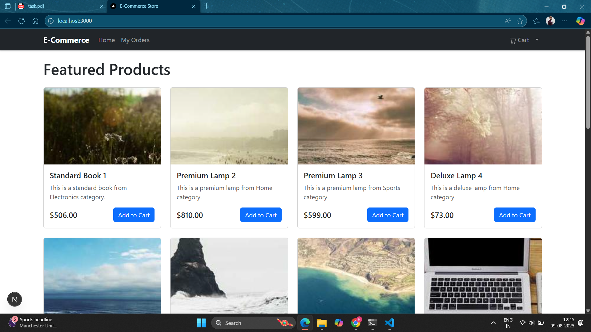
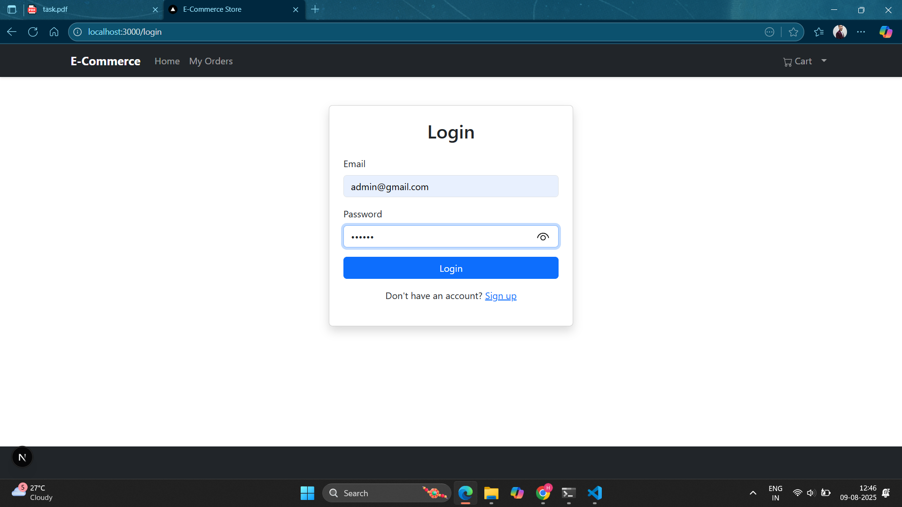
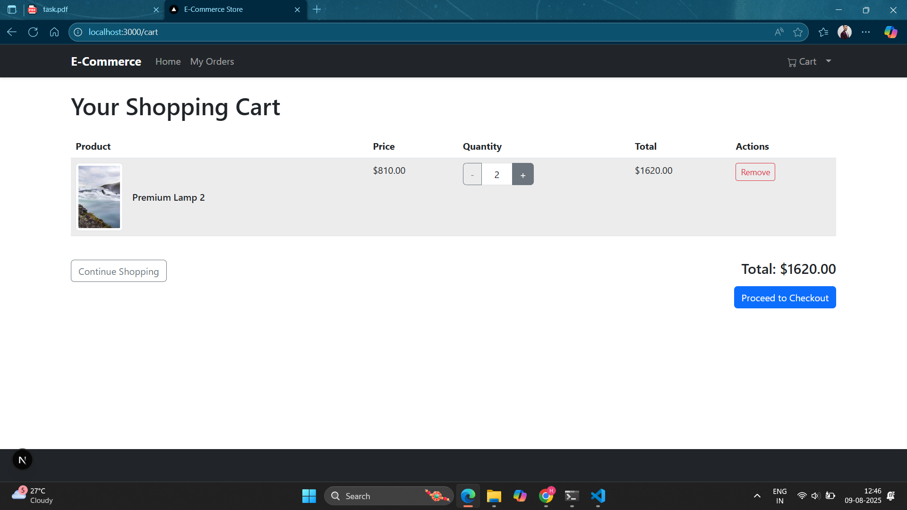

# 🛍️ E-Commerce App – Frontend

This is the **frontend** for the E-Commerce App, built with **React.js**, **Redux**, and **Tailwind CSS**.  
It connects to the backend API to display products, manage cart, process orders, and handle user authentication.

---

## 🚀 Features

- Modern UI with Tailwind CSS
- Product listing with search & filter
- Product details page
- Add to cart / remove from cart
- User authentication (Login / Signup)
- Order placement and tracking
- Responsive design for mobile and desktop

---

## 🖼️ Screenshots

### 1️⃣ Home Page

### 2️⃣ Login Page

### 3️⃣ Cart Page

### 4️⃣ Order Success

---

## 📂 Project Structure

